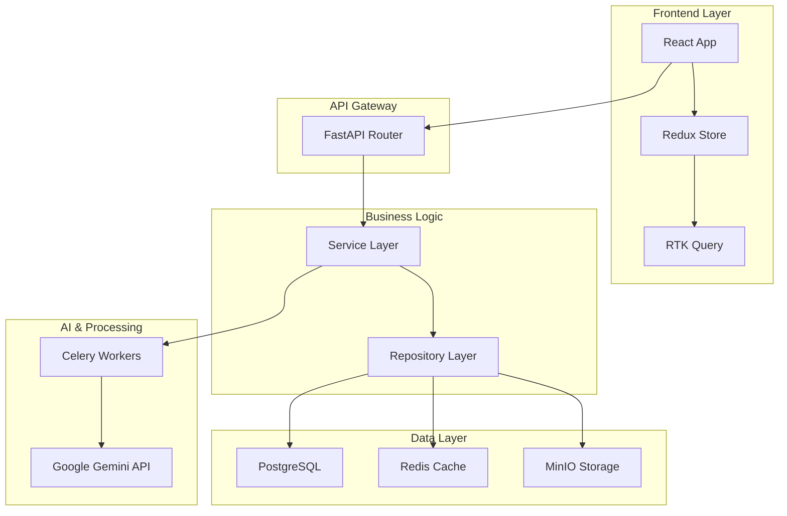
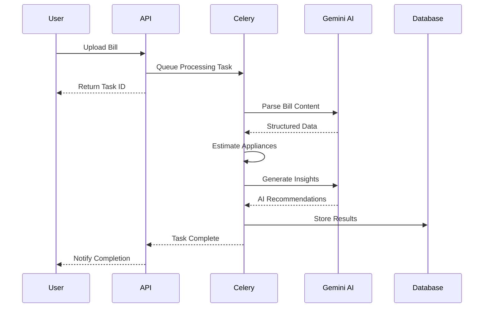

# ⚡ GreenSpark – Smart Energy Management Platform

<div align="center">


[](https://fastapi.tiangolo.com/)
[](https://reactjs.org/)
[](https://postgresql.org/)
[](https://redis.io/)
[](LICENSE)

**AI-powered energy management platform that transforms your electricity bills into actionable insights**

</div>

---

## 🌟 **Overview**

GreenSpark is a comprehensive, full-stack energy management solution that leverages artificial intelligence to analyze electricity bills and provide intelligent recommendations for optimizing energy consumption. Built with modern technologies and scalable architecture, it offers secure bill processing, appliance-level consumption estimation, and automated insights generation.

---

## ✨ **Key Features**

<table>
<tr>
<td>

### 🔐 **Secure Authentication**

- JWT with refresh token rotation
- Redis-based token blacklist
- Argon2 password hashing
- Role-based access control

</td>
<td>

### 📂 **Smart Bill Processing**

- Presigned S3 uploads via MinIO
- AI-powered parsing with Google Gemini
- Structured JSON validation
- Async processing pipeline

</td>
</tr>
<tr>
<td>

### ⚡ **Intelligent Analytics**

- Algorithmic appliance consumption breakdown
- AI-generated energy-saving recommendations
- Real-time insights and reporting
- Historical data analysis

</td>
<td>

### 🎨 **Modern Interface**

- Responsive React frontend
- Interactive charts and visualizations
- Real-time status updates
- Mobile-friendly design

</td>
</tr>
</table>

### 🚀 **Additional Capabilities**

- **🧩 Scalable Architecture** → Dockerized multi-container deployment
- **🚦 Rate Limiting & Caching** → Redis-powered performance optimization
- **📊 Data Visualization** → Interactive charts with Recharts
- **🛡️ Enterprise Security** → Comprehensive security headers and middleware

---

## 🛠️ **Technology Stack**

### **Backend Infrastructure**

```
🚀 Framework         → FastAPI (async-first architecture)
🗃️ Database          → PostgreSQL + SQLModel ORM
⚡ Async Tasks       → Celery + Redis
🗄️ File Storage      → MinIO (S3-compatible)
🤖 AI Integration    → Google Gemini API
🔒 Security          → JWT, Argon2, RBAC
📦 Containerization  → Docker & Docker Compose
📝 Dependency Mgmt   → Poetry
```

### **Frontend Experience**

```
⚛️ Framework         → React 18 + Vite
🗂️ State Management  → Redux Toolkit + RTK Query
🎨 Styling           → TailwindCSS + shadcn/ui
🧭 Routing           → React Router DOM
📊 Visualization     → Recharts
🔔 Notifications     → Sonner
🎭 Icons             → Lucide React
```

---

## 🏗️ **Architecture Overview**

<div align="center">



</div>

### 🧱 **Layered Backend Design**

| Layer                 | Responsibility                          | Components           |
| --------------------- | --------------------------------------- | -------------------- |
| **🌐 API Layer**      | Request handling, validation, responses | FastAPI Routers      |
| **⚙️ Business Layer** | Domain logic, orchestration             | Service Classes      |
| **🗄️ Data Layer**     | CRUD operations, data access            | Repository Pattern   |
| **🔧 Infrastructure** | External services, utilities            | Redis, MinIO, Celery |

---

## 🔐 **Security Framework**

<details>
<summary><strong>🛡️ Click to expand security features</strong></summary>

### **Authentication & Authorization**

- ✅ **JWT Token Management** with access/refresh token rotation
- ✅ **Multi-layered Token Types** (access, refresh, email verification, password reset)
- ✅ **Real-time Token Revocation** via Redis blacklist
- ✅ **Role-Based Access Control** with hierarchical permissions
- ✅ **Brute Force Protection** with configurable rate limiting

### **Password Security**

- ✅ **Argon2 Hashing** (preferred) with bcrypt fallback
- ✅ **Automatic Rehashing** for outdated parameters
- ✅ **Timing Attack Protection** with constant-time comparison
- ✅ **Transparent Security Upgrades** without user disruption

### **Security Headers**

```http
X-Content-Type-Options: nosniff
X-Frame-Options: DENY
Referrer-Policy: strict-origin-when-cross-origin
Cross-Origin-Opener-Policy: same-origin
Cross-Origin-Resource-Policy: same-origin
Permissions-Policy: camera=(), microphone=(), geolocation=()
```

### **Token Configuration**

- 🕐 **Access Token TTL**: 15 minutes
- 🕕 **Refresh Token TTL**: 7 days
- 🔄 **Clock Skew Tolerance**: Configurable leeway
- 🎯 **Audience Validation**: Prevents cross-app token misuse

</details>

---

## 🚦 **Middleware Stack**

<details>
<summary><strong>⚙️ Click to expand middleware architecture</strong></summary>

Our middleware follows a carefully orchestrated execution order for optimal security and performance:

```
1. 📝 Logging & Error Handling    → Outermost layer for comprehensive monitoring
2. 🌐 CORS Management             → Early CORS header processing
3. 🛡️ Trusted Host Validation    → Host header attack prevention
4. 🔒 Security Headers            → Defense-in-depth security measures
5. 📦 GZip Compression           → Response optimization
6. 📏 Request Size Limiting      → DoS protection (innermost)
```

### **Custom Middleware Features**

- **🎯 Centralized Exception Handling** → Consistent error responses
- **📊 Structured Logging** → Request correlation with unique IDs
- **🛡️ Security Layer** → Advanced header and access pattern validation
- **⚡ Performance Optimization** → Intelligent caching and compression

</details>

---

## 🚨 **Exception Handling System**

<details>
<summary><strong>🔧 Click to expand error management</strong></summary>

### **Layered Exception Architecture**

```python
# Consistent Error Response Format
{
  "error": {
    "code": "INVALID_CREDENTIALS",
    "message": "Incorrect email or password",
    "status_code": 401,
    "context": {},
    "error_id": "uuid-for-tracking"
  }
}
```

### **Exception Flow**

1. **🎯 Custom App Exceptions** → Business logic errors with structured codes
2. **✅ Validation Exceptions** → FastAPI/Pydantic validation normalization
3. **🌐 HTTP Exceptions** → Starlette HTTP error standardization
4. **🚨 Unhandled Exceptions** → Safe fallback with tracking IDs

### **Benefits**

- ✅ **Consistency** → Unified JSON error format
- 🔍 **Debuggability** → Rich logging with context
- 🛡️ **Security** → No internal detail leakage
- 🔧 **Extensibility** → Easy custom exception addition

</details>

---

## 🧵 **Async Task Processing**

<div align="center">



</div>

### **Async Pipeline Features**

- 📧 **Email Processing** → Welcome, verification, password reset workflows
- 📄 **Bill Processing** → AI parsing, appliance estimation, insight generation
- ⚡ **Worker Scalability** → Horizontal scaling with Docker containers
- 📊 **Task Monitoring** → Real-time status tracking and progress updates

---

## 📊 **Data Management**

### **Database Architecture**

- **🗃️ PostgreSQL** → Primary data store with ACID compliance
- **📝 SQLModel** → Type-safe ORM with Pydantic integration
- **🔄 Alembic Migrations** → Version-controlled schema evolution
- **✅ Pydantic Schemas** → Robust data validation and serialization

### **Migration Management**

```bash
# Generate new migration
poetry run alembic revision --autogenerate -m "description"

# Apply migrations
poetry run alembic upgrade head

# View migration history
poetry run alembic history
```

---

## 🎨 **Frontend Architecture**

### **State Management Strategy**

```
📦 Redux Toolkit Store
├── 🔐 authSlice        → Authentication state
├── 🎨 uiSlice          → UI preferences & alerts
├── 📊 authApi          → Authentication endpoints
├── 👤 userApi          → User management
├── 📄 billApi          → Bill operations
├── ⚡ applianceApi     → Appliance management
└── 💡 insightApi       → Insights & analytics
```

### **UI Components & Features**

- **📱 Responsive Design** → Mobile-first approach with TailwindCSS
- **📊 Interactive Charts** → Recharts with custom legends and layouts
- **⏳ Loading States** → Skeleton loaders for seamless UX
- **🔄 Real-time Updates** → Polling for long-running tasks
- **🎭 Modern UI** → shadcn/ui components with Lucide icons

---

## 🚀 **Getting Started**

### **Prerequisites**

- 🐳 Docker & Docker Compose
- 🐍 Python 3.11+
- 📦 Node.js 18+
- 📝 Poetry (Python dependency management)

### **1️⃣ Clone Repository**

```bash
git clone https://github.com/vansh212121/Green-Spark.git
cd greenspark
```

### **2️⃣ Backend Setup**

```bash

# Install dependencies
poetry install

# Copy environment template
cp .env.example .env
# Edit .env with your configuration

# Start infrastructure services
docker-compose up -d postgres redis minio

# Apply database migrations
poetry run alembic upgrade head

# Start development server
poetry run uvicorn app.main:app --reload --host 0.0.0.0 --port 8000
```

**🌐 Backend URL:** `http://localhost:8000/api/v1`
**📚 API Docs:** `http://localhost:8000/docs`

### **3️⃣ Frontend Setup**

```bash
cd frontend

# Install dependencies
npm install

# Start development server
npm run dev
```

**🌐 Frontend URL:** `http://localhost:5173`

---

## 📝 **Development Guidelines**

### **Backend Development**

- ✅ Run `poetry install` before starting development
- ✅ Apply database migrations manually via Alembic
- ✅ Ensure Docker services (PostgreSQL, Redis, MinIO) are running
- ✅ Configure `.env` files with proper values
- ✅ Follow FastAPI best practices and dependency injection patterns

### **Frontend Development**

- ✅ Use TypeScript for type safety
- ✅ Follow Redux Toolkit patterns for state management
- ✅ Implement proper error boundaries
- ✅ Use TailwindCSS utility classes consistently
- ✅ Add proper loading states and error handling

### **Code Quality**

- 🔍 **Linting** → Pre-commit hooks with Black, isort, flake8
- 🧪 **Testing** → Pytest for backend, Jest for frontend
- 📝 **Documentation** → Comprehensive docstrings and comments
- 🔄 **CI/CD** → Automated testing and deployment pipelines

---

## 📈 **Project Status**

<div align="center">

| Component            | Status           | Features                                   |
| -------------------- | ---------------- | ------------------------------------------ |
| 🔧 **Backend**       | ✅ Complete      | DI, caching, rate-limiting, async pipeline |
| 🎨 **Frontend**      | ✅ Complete      | Protected routes, Redux, charts, polling   |
| 🐳 **Deployment**    | ✅ Ready         | Docker, multi-container orchestration      |
| 📚 **Documentation** | ✅ Comprehensive | API docs, architecture guides              |
| 🧪 **Testing**       | 🚧 In Progress   | Unit tests, integration tests              |
| 📊 **Monitoring**    | 🔮 Planned       | Logging, metrics, health checks            |

</div>

---

## 📄 **License**

This project is licensed under the **MIT License** - see the [LICENSE](LICENSE) file for details.

---

## 🙏 **Acknowledgments**

- **FastAPI** for the excellent async framework
- **Google Gemini** for AI-powered bill parsing
- **Recharts** for beautiful data visualizations
- **TailwindCSS** for utility-first styling
- **Redis** for caching and task queuing

---

<div align="center">

**⚡ Built with passion for sustainable energy management ⚡**

[](https://github.com/vansh212121/Green-Spark/stargazers)
[](https://github.com/vansh212121/Green-Spark/network)
[](https://github.com/vansh212121/Green-Spark/issues)

</div>
